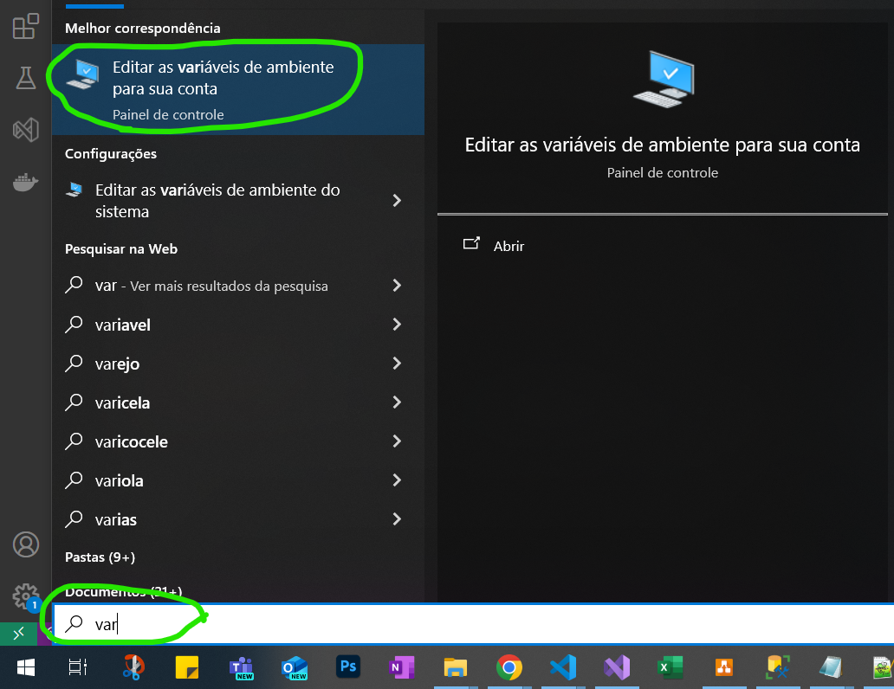

## DESAFIO VERIPAG PREVISÃO DO TEMPO

### PROPOSTA:
Desenvolva uma API em .NET que consuma uma API externa de previsão do tempo, como a OpenWeatherMap ou a Weather API, para exibir a previsão do tempo para uma cidade específica inserida pelo usuário. A aplicação deve ser capaz de mostrar a previsão do tempo atual, além de previsões para os próximos 5 dias.

<b>Requisitos Funcionais</b><br>
<b>1. Endpoint para Consulta de Previsão do Tempo Atual:</b> A aplicação deve permitir ao usuário inserir o nome de uma cidade e, em seguida, exibir a previsão do tempo atual para essa cidade, incluindo temperatura, umidade, descrição do tempo (ensolarado, nublado, etc.), e velocidade do vento.<br>
<b>2. Endpoint para Previsão do Tempo Estendida:</b> Além da previsão atual, a aplicação deve oferecer uma opção para visualizar a previsão estendida para os próximos 5 dias, mostrando as condições diárias esperadas.<br>
<b>3. Endpoint para Histórico de Buscas:</b> A aplicação deve permitir que o histórico de buscas seja consultado, retornando o resumo das ultimas regiões visualizadas.

<b>Requisitos Não Funcionais</b><br>
<b>1. Configuração:</b> Permitir que a chave API necessária para a consulta da API externa seja configurada facilmente, sem necessidade de alterações no código.</br>
<b>2.Tratamento de Erros:</b> Implementar tratamento adequado de erros, incluindo erros de rede e erros retornados pela API externa.<br>
<b>3.Cache:</b> Implementar Cache com banco de dados SQL para que as consultas feitas sejam armazenadas e que sejam evitadas novas chamadas para API.<br>
<b>4.Testes unitários:</b> Implementar testes unitários com pelo menos 50% de cobertura.<br>
<b>5.Serviço em Background para limpar o cache:</b> Criar um serviço em background que limpe o cache a cada 1h.<br>

<b>Conceitos e Padrões a Serem Avaliados</b><br>
Swagger para visualização da API.<br>
Consumo de APIs REST.<br>
Programação Assíncrona.<br>
Injeção de Dependência.<br>
Princípios SOLID.<br>
Logs.<br>
Documentação e código comentado.<br><br>
<b>Entrega:</b> O código fonte deve ser entregue em um repositório Git, acompanhado de um README detalhando instruções de configuração, uso da aplicação, e uma descrição das principais decisões técnicas tomadas durante o desenvolvimento.<br><br><br>

### SOLUÇÃO:

Iniciei avaliando quais das opções de API externa escolher, [OpenWeather](https://openweathermap.org/) ou [Weather API](https://www.weatherapi.com/)), optei pelo WeatherAPI, devido possuírem uma boa Documentação e disponibilizarem um Swagger para testes:


Posteriormente modelei com a ferramenta [Draw.IO](https://app.diagrams.net/) a primeira versão do Diagrama de Classe para usar como base pro Banco de dados:


Na etapa de codificação, usei o .Net8 e estruturei a aplicação com base no DDD em 4 camadas (Domínio-Aplicação-Infraestrutura-Serviço), utilizei também os princípios de CQRS (Separação das classes de Commands e Queries) e o MediatR para fazer a manipulação das classes Handlers, tornando o ambiente de fácil escalabilidade e manutenibilidade futura:


Após programação dos Requisitos Funcionais, este foram os endpoints disponíveis no Swagger para consumo:<br>


São 3 pontos de acesso para obtenção de dados (GET).<br>
* 1º - Solicita a Cidade a ser pesquisada e retorna um Json com as informações/condições do tempo/clima, como temperatura, umidade, descirção do tempo, e velocidade do vento:


* 2º - Solicita a Cidade a ser pesquisada e retorna um objeto Json com a lista da previsão do tempo para o dia atual e as médias dos próximos 5 dias:


* 3º - Não é solicitada nenhuma informação como parâmetro para este endpoint. Ao ser executado, ele acessa o Banco de Dados e retorna um Json contendo uma lista de registros das últimas buscas realizadas, contendo a data/hora da busca, cidade pesquisada e o tipo de previsão solicitada:


As consultas realizadas pela API são armazendas no Banco de Dados Relacional SqlServer, para utilização de cache no prazo estipulado(1h), evitando novas consultas à API externa dentro deste período:


Com o sucesso no retorno dos dados obtidos pelo consumo da API externa, inicei a etapa de refatoração para atender os Requisitos não funcionais.
* 1º - Inicialmente configurei a Chave de Autenticação (token) do WeatherApi no arquivo AppSettings.json e acessava os dados por meio da Injeção da Interface IConfiguration na classe do serviço, posteriormente optei por incluir o token (Chave: valor) nas variáveis de ambiente do Windows, onde é facilmente possível alterá-la e tratá-la na aplicação com o comando Environment.GetEnvironmentVariable("WeatherApi_Key").
* 2º - Em caso de erros no consumo da API externa, será lançada uma exceção na classe de serviço e será tratada na controller com um retorno de uma mensagem simples para o usuário.
* 3º - Foi realizada a utilização do EntityFrameworkCore para modelagem do Banco de Dados no modo CodeFirst, onde definimos as classes(propriedades) a serem mapeadas no arquivo de Contexto da Aplicação e com a execução de 2 comandos(Add-Migration e UpdateDatabase) obtive o Banco De Dados.
* 4º - Foi realizada a criação dos projetos de testes, no entanto a priore somente a camada de Domínio está coberta, posteriormente irei examinar um problema na injeção de dependência dos repositórios e utilização de Moqs para testes das demais camadas.
* 5º - Para a limpeza recorrente do Banco de Dados (Cache), utilizei a interface nativa do DotNet para BackgroundTasks, a IHostedService com auxílio da classe Timer, para monitorar o intervalo de execução. Basicamente ao iniciar a aplicação e após o intervalo definido por meio de uma constante, um método aciona a camada de infraestrutura (Design Pattern Repository) e exclui os dados.
* 6º - Utilizei o acionamento de métodos de extensão do IServiceCollection e do IConfiguration na classe Program, para registrar as dependências, como Interfaces, Repositorios, MediatR, DbContext, BackgroundTasks, Swagger e demais configurações da API, tornando a classe mais limpa e de fácil detecção de problemas na pilha de execução de erros.
* 7º - Ao iniciar, a aplicação verifica se a máquina de hospedagem possui a variável de ambiente(chave/valor), necessárias para consumo da API externa WeatherAPI, em caso negativo a aplicação é encerrada abruptamente com a mensagem solicitando tal configuração.

### CONFIGURAÇÃO DO SETUP:

* <b>Realize a o clone deste repositório com o comando:</b>
<br>``` git clone https://github.com/cleitoncardososp/Veripag.Desafio.PrevisaoDoTempo.Api.git ```<br><br>

* <b>Adicione a Chave de Autenticação (token)</B> do [WeatherAPI](https://www.weatherapi.com/) nas variáveis de ambiente da sua conta no Windows acessando:



Cliclar em novo e Definir a sua Chave e Valor:


Posteriormente é altamente recomendável reiniciar o computador para aplicar essa nova configuração.<br><br><br>


* <b>Gere o Banco de Dados</b>, com a aplicação aberta no Visual Studio, acesse a janela de Console do Gerenciador de Pacotes e execute o comando: 
<br>``` Update-Database ```<br>


*OBS:* Em caso de erro, necessário verificar configurações/parametros de acesso ao Servidor do Banco (string de conexão), no arquivo: appsettings.Development.json

E execute a aplicação, em caso de erro, favor verificar os logs de saída.

Obrigado.